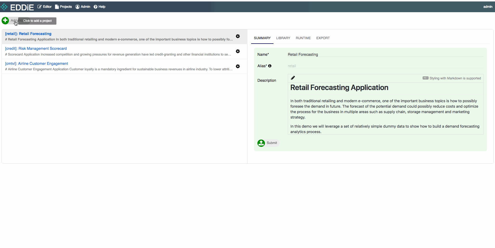
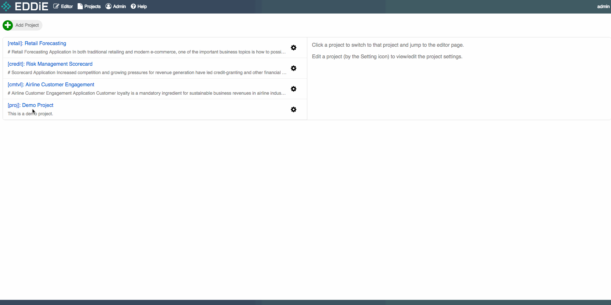
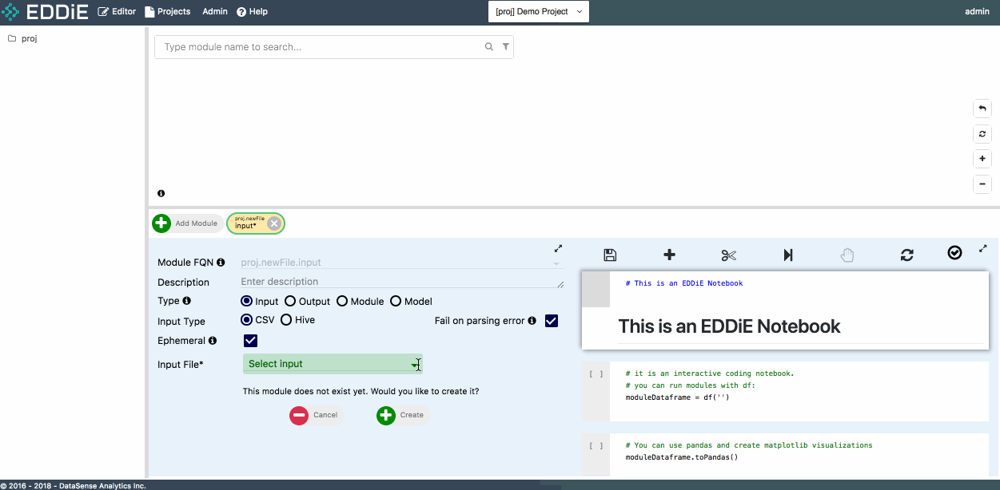
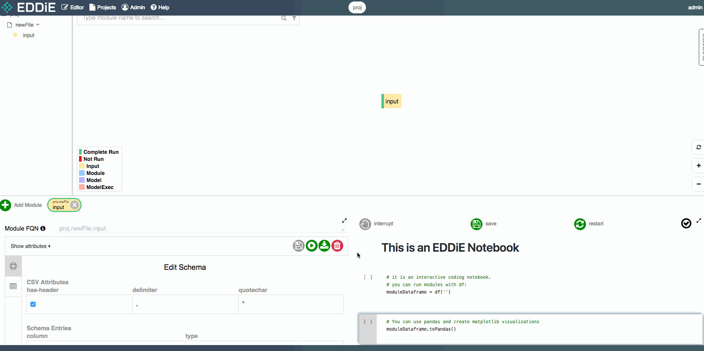
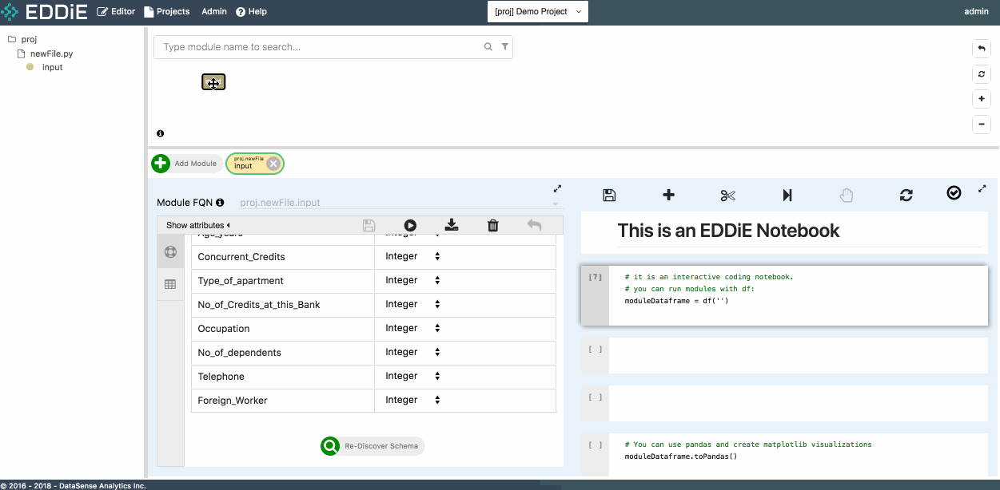
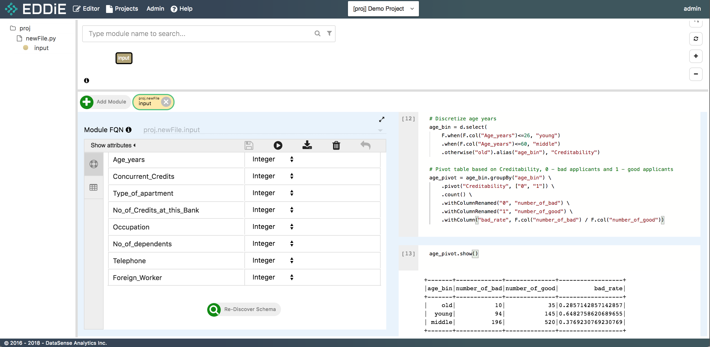
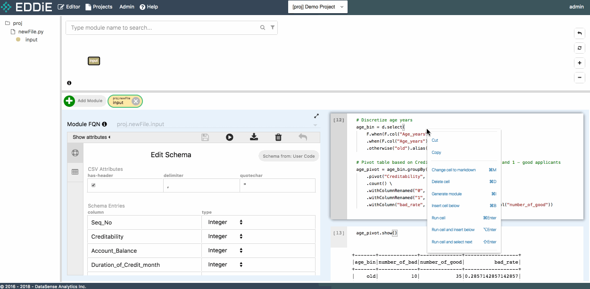
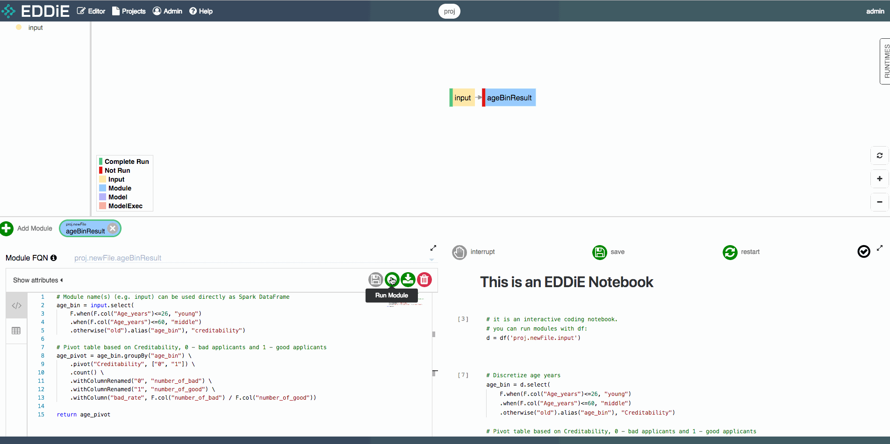

# Beginner Tutorial

Welcome to the beginner tutorial for first time EDDiE users! This guide takes you 10 minutes to introduce the basic concepts of EDDiE and helps you get started.

## Step 1 - Download CSV

We will use a credit dataset in this tutorial, please first download it from [here](./credit_data.csv). This dataset classifies people described by a set of attributes as good or bad credit risks.

## Step 2 - Create a new project

Project is a workspace where you can collaborate with team members to take a series of tasks which includes but not limit to uploading data, performing ad-hoc analysis, building data pipeline and so on.

When logged into EDDiE, look in the upper-left corner and click on `Add Project`. We are going to create a `Demo Project` in this step.



## Step 3 - Upload your data and create first module

Now that we have created a new project, let's go to this project and generate our first module.

Module is a sequence of Spark DataFrame operations which takes multiple input DataFrames and generates a single DataFrame.

To create a module, click on `Add Module` in the Module Editor Page and check `Input` as module type.



Then click on `Upload a csv...` from `Input File` field and upload the csv file you just downloaded in step 1. 

This csv file is separated by comma and with a header in the first row. To apply a schema to the input module, please check `has-header` under `CSV Attributes` and click on `Discover Schema`. Feel free to modify column name or column type at this moment or just click on `Create` to finish module creation. Then you can see your first module in tree view and dependency graph.



## Step 4 - Discover your data in Notebook

After module creation, let's move to right-side Notebook area. Firstly, to use EDDiE's notebook, you can see some notebook-level operations on the top, such as "Save". You can click a specific cell, and then **right-click** the cell to access cell-level functions and refer to the corresponding short-cuts. For example, we will add a new cell in the notebook:


Pass module FQN `proj.newFile.input` to `df()` function, and run this cell. The result of this module is returned to Spark Dataframe `d`. Now feel free to run a few simple commands to get a preliminary understanding of data structure.



## Step 5 - Perform analysis in Notebook

Let's perform some advanced analysis in this step. Please copy and paste below pyspark code to the cell in your Notebook. This code of piece is to create a binning column from age years and check the bad applicants rate across different age periods.

```
# Discretize age years
age_bin = d.select(
    F.when(F.col("Age_years")<=26, "young")
    .when(F.col("Age_years")<=60, "middle")
    .otherwise("old").alias("age_bin"), "Creditability")

# Pivot table based on Creditability, 0 - bad applicants and 1 - good applicants
age_pivot = age_bin.groupBy("age_bin") \
    .pivot("Creditability", ["0", "1"]) \
    .count() \
    .withColumnRenamed("0", "number_of_bad") \
    .withColumnRenamed("1", "number_of_good") \
    .withColumn("bad_rate", F.col("number_of_bad") / F.col("number_of_good"))
```

In the output, you can see the bad applicant rate declines as age grows.



## Step 6 - Create another module from Notebook

Although Notebook is a good place for iterative and experimental data science, it is not quite readable and mainable when project gets big and complicated. EDDiE allows you to use chunks of ad-hoc code in Notebook to generate modules and build a scalable and deployable data pipeline easily.

To create another module, click on `Add Module`, choose `Module` type, select first module `proj.newFile.input` as dependency and click on `Create`.

Then copy the code from Notebook to code block in Module Editor Form, modify input and output dataframe name accordingly and click on `Submit`. A new module appears in dependency graph now.



## Step 7 - Run your modules

Once module is created, let's check whether module result is as expected. There are three ways to run a module in EDDiE
1. Click on the green button `Run Module` in Module Editor Form
2. Right click module chip in dependency graph and click on `Run Module`
3. Right click module name in tree view and click on `Run Module`

After module finishes running, 10 sample rows (if the number of rows of the final output exceeds 10) are returned and module chip turns from red to green in dependency graph. If you want to get the complete result, just click on `Export to CSV` next to `Run Module` and CSV file will be downloaded to your laptop.

